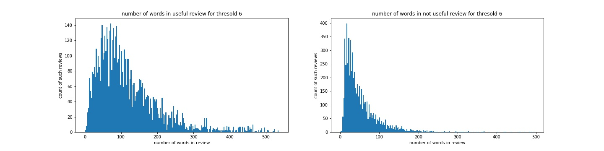
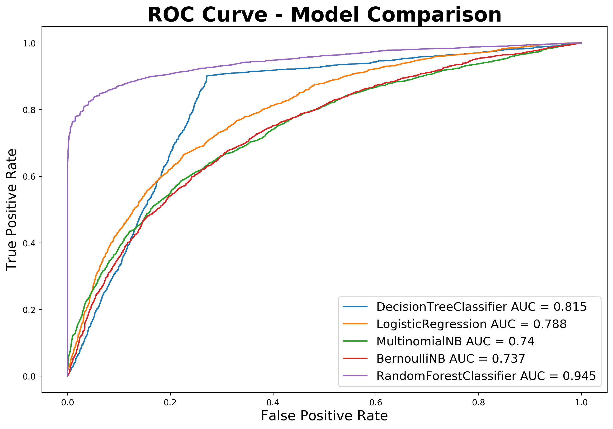
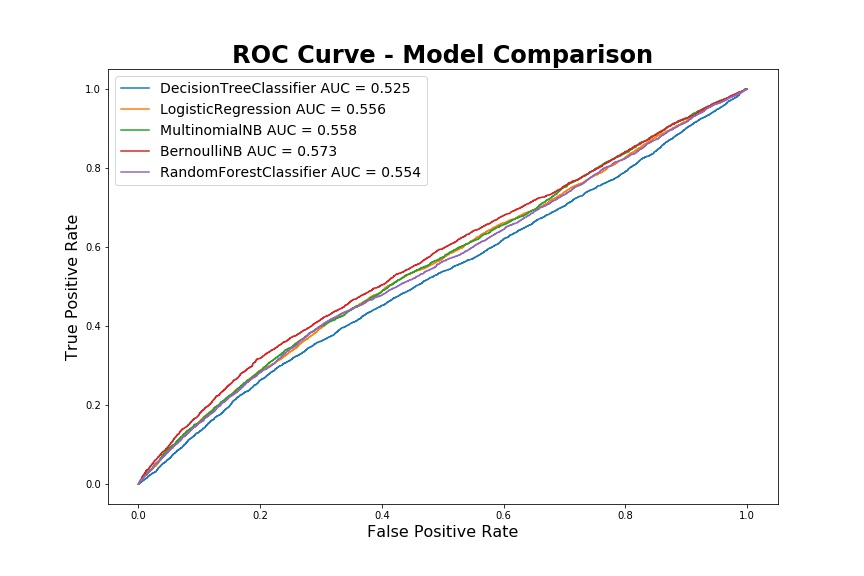
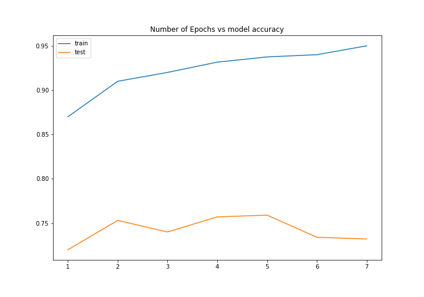

## Yelp review usefullness prediction

By Purvi Joshi

# Overview

Yelp has become very useful app now a days to serach for almost all utility. This project is about predicting if yelp review will be useful or not. Generally people read only first few review so if we can successfully predict if people will find a review useful or not, yelp can give it a priority and put in before reviews that are predicted as not useful.

# Dataset

[Dataset is available here :](https://www.yelp.com/dataset/challenge)
This dataset contains 6668738 reiews from 179974 different businesses. So if we consider useful count 0 as not useful review and useful count >=1 as useful review than distribution of useful and not useful review out of 6668738 reviews is as below:

For this project, out of  1489 indian restaurants in yelp dataset, 79767 reviews are extracted from json file using pypark by joining below 2 tables and searching key word "india" in categories column of business table. So if we consider useful count 0 as not useful review and useful count >=1 as useful review than distribution of useful and not useful review out of 79767 reviews is as below:

Data are taken from 2 files review.json and business.json, following columns are used for this project:

review file columns

        Column - Description - Datatype
        
  - business_id - company id - alphanumeric
  - text - comments made by reviwer - Text statements
  - useful - if comment was helpful or not, liked by reviwers - number
  - funny - if comment was funny or not, liked as funny by reviwers - number
  - cool - if comment was cool or not, liked as cool comment by reviwers - number
  
business file columns

        Column - Description - Datatype
        
  - business_id - company id - alphanumeric
  - name - Name of company - String
  - categories - Type of business - String
  
  

# EDA

# Data Cleaning
- Data with missing reviews are removed
    
# Feature selection
##### Performed following steps to select most frequent words from pros and cons:
- Normalized text 
- Remove special charcters using Regular Expression
- Tokenization
- Remove stop words
- create vector using tf-idf

# Number of words and number of reviews distribution

# Model selection and ROC curve

Using over and under sampling, Model was overfitting because validation accuracy is above 90% where as test accuracy was 63% only

Validation accuarcy is very poor using 2-gram 

# Using LSTM

To solve problem of overfitting I tried using LSTM model. For creating LSTM model,I have used the Tokenizer function provided in Keras.Initial model contained 1 embedding layer and 1 LSTM layer with a 30% test data was giving poor results. After doing some parameter tuning I ended up using a Sequential Keras model with 1 embedding layer, 2 LSTM layers and 10% test data. And I could get 74% accuracy compared to 63% with Random Forest and Naive Bayse with over and under sampling.

# Recreation

Data can be extracted from json file into pandas dataframe using 'src/data_extract_spark_.py'. Code for EDA and basic models generation is in 'src/pre_process_and_basic_model.py'. And code for LSTM model is in 'src/lstm_model.py'.

# Future Work

- Improve LSTM model for better prediction
- Use LSTM model for predicting usfulness of all types of restaurant reviews
- Recommend restaurant based on useful review

